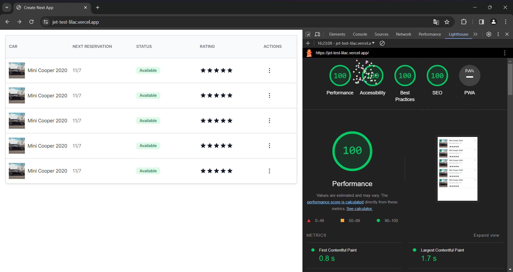

# Teste Técnico: Desenvolvedor Front-end JR

Criar uma aplicação web responsiva, utilizando as tecnologias propostas, onde seja exibida em telas as versões do data-table exposto no figma.
A idéia nesta avaliação é avaliar a capacidade de resolução de problemas dos candidatos, como também a criatividade nesse processo.

[`Ver Projeto`](https://jet-test-lilac.vercel.app/)

## Requisitos obrigatórios

- NextJS (AppRouter)
- TypeScript
- TailwindCSS
- Composition Pattern
- Componetização
- GitFlow
- Deploy na Vercel

## Figma

[`Protótipo`](https://www.figma.com/file/pXIEbENrC64kRCMbvctXnv/Teste-T%C3%A9cnico-Desenvolvedor-Jr.-Front-End?type=design&node-id=0-1&mode=design)

## Lighthouse

